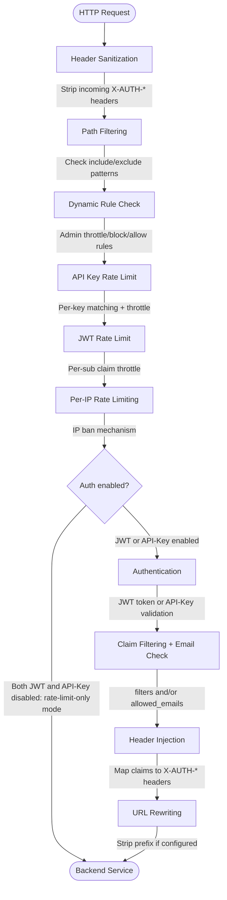

# lite-auth-proxy

[](https://golang.org/)
[](LICENSE)

A high-performance, minimalist reverse proxy with JWT and API-Key authentication, designed for serverless sidecar deployments on Google Cloud Run and other container platforms.

## Overview

lite-auth-proxy is a lightweight authentication proxy that sits in front of your backend services, handling JWT token validation, API-key authentication, and access control before forwarding requests upstream. It's optimized for serverless environments with sub-50ms startup time and minimal memory footprint (<32MB).

### Key Features

- **Dual Authentication**: JWT (JWKS auto-discovery) and API-Key authentication
- **Rate-Limit-Only Mode**: Disable both auth methods to forward all requests without credential checks — rate limiting still applies
- **High Performance**: Fast startup (<50ms), minimal memory (<32MB)
- **Zero-Trust Security**: Header sanitization, claim-based access control
- **Unified Rate Limiting**: Per-IP, per-API-key, and per-JWT rate limiting with configurable request matching and automatic ban mechanism
- **Dynamic Control Plane**: Runtime throttle/block/allow rules via `/admin/control` API — no restart needed
- **Throttle Delay**: Optional DDoS-safe delay on rate-limited responses to improve stability under attack
- **Rule Persistence**: Active throttle rules survive Cloud Run instance restarts via `PROXY_THROTTLE_RULES`
- **Structured Logging**: JSON/text logging with `slog`, Google Cloud Logging compatible
- **URL Rewriting**: Strip path prefixes before forwarding
- **Health Checks**: Configurable health endpoint with proxy-to-downstream support
- **Flexible Configuration**: TOML config files with environment variable overrides

## Quick Start

### Prerequisites

- Go 1.23 or later
- Docker (optional, for containerized deployment)

### Installation

```bash
git clone https://github.com/fp8/lite-auth-proxy.git
cd lite-auth-proxy
go mod download
make build
```

### Basic Usage

```bash
# Create and edit your .env
cp .env.example .env

# Run with default config
make run

# Or with custom config
./bin/lite-auth-proxy -config /path/to/config.toml
```

### Test the Proxy

```bash
# Health check (bypasses authentication)
curl http://localhost:8888/healthz

# Request with JWT
curl -H "Authorization: Bearer <YOUR_JWT_TOKEN>" \
  http://localhost:8888/api/users

# Request with API key
curl -H "X-API-KEY: your-secret-key" \
  http://localhost:8888/api/admin
```

## Architecture



> **Admin API** (`/admin/control`, `/admin/status`) sits on the same mux but is handled before the pipeline. It is only registered when `admin.enabled = true`.

## Documentation

- **[Configuration Guide](docs/CONFIGURATION.md)** — Complete configuration reference with all options, filters, and mappings
- **[Rate Limiting Guide](docs/RATE-LIMITING.md)** — Per-IP, per-API-key, and per-JWT rate limiting, throttle delay, and dynamic rules
- **[Admin Control Plane](docs/ADMIN.md)** — Runtime traffic management, rule lifecycle, and serverless caveats
- **[Environment Variables Guide](docs/ENVIRONMENT.md)** — All environment variables, substitution syntax, and precedence rules
- **[API Documentation](docs/API.md)** — HTTP endpoints, authentication flow, and error responses
- **[Deployment Guide](docs/DEPLOYMENT.md)** — Docker builds, Cloud Build, Cloud Run, sidecar pattern, and production setup
- **[Development Guide](docs/DEVELOPMENT.md)** — Setup, testing, debugging, and contribution guidelines
- **[AGENTS.md](AGENTS.md)** — Dense technical specification for LLM consumption

## Performance

- **Startup Time**: <50ms (cold start)
- **Memory Footprint**: <32MB (typical runtime)
- **Request Latency**: <5ms added latency (excluding JWT signature verification)
- **Throughput**: 10,000+ req/s on a single core

## Security

- Constant-time API key comparison prevents timing attacks
- Header sanitization prevents header injection attacks
- Zero-trust model validates every request
- Minimal attack surface using distroless container image
- Non-root execution in container

## Contributing

Contributions are welcome! Please see our [Development Guide](docs/DEVELOPMENT.md) for details.

## License

This project is licensed under the Fair Code License. You are free to use this software
internally within your organization. Commercial use (reselling, offering as SaaS, or
generating revenue) requires a separate commercial license.

See the [LICENSE](LICENSE) file for the complete license terms and contact information
for commercial licensing inquiries.

## Support

- **Issues**: [GitHub Issues](https://github.com/YOUR_ORG/lite-auth-proxy/issues)
- **Documentation**: [docs/](docs/)
- **Discussions**: [GitHub Discussions](https://github.com/YOUR_ORG/lite-auth-proxy/discussions)

## Roadmap

- [ ] mTLS support for upstream connections
- [ ] Plugin system for custom authentication methods
- [ ] Prometheus metrics export
- [ ] WebSocket proxying support
- [ ] gRPC proxying support

## Acknowledgments

Built with:
- [BurntSushi/toml](https://github.com/BurntSushi/toml) - TOML parsing
- Go standard library for HTTP, crypto, and JWT handling
- Google Cloud Secret Manager SDK (optional)

---

**Made with love for secure, lightweight authentication proxying**
