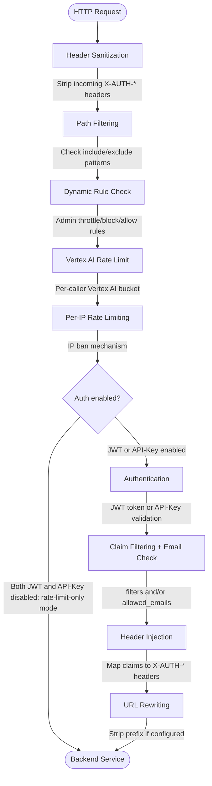

# lite-auth-proxy

[](https://golang.org/)
[](LICENSE)

A high-performance, minimalist reverse proxy with JWT and API-Key authentication, designed for serverless sidecar deployments on Google Cloud Run and other container platforms.

## Overview

lite-auth-proxy is a lightweight authentication proxy that sits in front of your backend services, handling JWT token validation, API-key authentication, and access control before forwarding requests upstream. It's optimized for serverless environments with sub-50ms startup time and minimal memory footprint (<32MB).

### Key Features

- 🔐 **Dual Authentication**: JWT (JWKS auto-discovery) and API-Key authentication
- 🔓 **Rate-Limit-Only Mode**: Disable both auth methods to forward all requests without credential checks — rate limiting still applies
- 🚀 **High Performance**: Fast startup (<50ms), minimal memory (<32MB)
- 🛡️ **Zero-Trust Security**: Header sanitization, claim-based access control
- 🎯 **Rate Limiting**: Per-IP rate limiting with automatic ban mechanism
- 🎛️ **Dynamic Control Plane**: Runtime throttle/block/allow rules via `/admin/control` API — no restart needed
- 🤖 **Vertex AI Rate Limiting**: Dedicated global or per-caller bucket for AI traffic, independent of per-IP limits
- 💾 **Rule Persistence**: Active throttle rules survive Cloud Run instance restarts via `PROXY_THROTTLE_RULES`
- 📊 **Structured Logging**: JSON/text logging with `slog`, Google Cloud Logging compatible
- 🔄 **URL Rewriting**: Strip path prefixes before forwarding
- 🏥 **Health Checks**: Configurable health endpoint with proxy-to-downstream support
- ⚙️ **Flexible Configuration**: TOML config files with environment variable overrides

## Quick Start

### Prerequisites

- Go 1.23 or later
- Docker (optional, for containerized deployment)

### Installation

```bash
# Clone the repository
git clone https://github.com/fp8/lite-auth-proxy.git
cd lite-auth-proxy

# Download dependencies
go mod download

# Build the binary
make build
```

### Basic Usage

1. **Create configuration file:**

```bash
# Copy example environment variables
cp .env.example .env

# Edit with your values
export GOOGLE_CLOUD_PROJECT=your-project-id
export API_KEY_SECRET=your-secret-key
```

2. **Run the proxy:**

```bash
# Run with default config
make run

# Or with custom config
./bin/lite-auth-proxy -config /path/to/config.toml
```

3. **Test the proxy:**

```bash
# Health check (bypasses authentication)
curl http://localhost:8888/healthz

# Request with JWT
curl -H "Authorization: Bearer <YOUR_JWT_TOKEN>" \
  http://localhost:8888/api/users

# Request with API key
curl -H "X-API-KEY: your-secret-key" \
  http://localhost:8888/api/admin
```

## Configuration

lite-auth-proxy uses TOML configuration files with environment variable substitution and overrides.

### Minimal Configuration

```toml
[server]
port = 8888
target_url = "http://localhost:8080"

[auth.jwt]
enabled = true
issuer = "https://securetoken.google.com/{{ENV.GOOGLE_CLOUD_PROJECT}}"
audience = "{{ENV.GOOGLE_CLOUD_PROJECT}}"
```

**Firebase default:** lite-auth-proxy is configured to support Firebase Authentication for the Google project defined in `GOOGLE_CLOUD_PROJECT` out of the box. By default, `GOOGLE_CLOUD_PROJECT` is used to populate both the JWT issuer and audience claims (the standard Firebase pattern), and the proxy substitutes `{{ENV.GOOGLE_CLOUD_PROJECT}}` with your environment value.

**Identity tokens (gcloud):** To validate identity tokens generated by `gcloud auth print-identity-token`, set these environment overrides:

```bash
export PROXY_AUTH_JWT_ISSUER="https://accounts.google.com"
export PROXY_AUTH_JWT_AUDIENCE="32555940559.apps.googleusercontent.com"
export PROXY_AUTH_JWT_FILTERS_EMAIL_VERIFIED="true"
export PROXY_AUTH_JWT_FILTERS_HD="<your-email-domain>"
```

### Environment Variables

Override any configuration value using the `PROXY_` prefix:

```bash
export PROXY_SERVER_PORT=9090
export PROXY_SERVER_TARGET_URL=http://backend:8080
export PROXY_AUTH_JWT_ENABLED=true
export PROXY_SECURITY_RATE_LIMIT_ENABLED=true
```

For a complete configuration reference, see the [Configuration Guide](docs/CONFIGURATION.md).

## Admin Control API

When `admin.enabled = true`, two additional endpoints are available for runtime traffic control without redeploying.

Authentication uses **GCP service account identity tokens** (OIDC JWTs). The calling service account obtains an ID token from the GCP metadata server and passes it as `Authorization: Bearer <token>`. Configure it in `[admin.jwt]` — this uses the same `JWTConfig` structure as `[auth.jwt]`.

Access control requires **at least one** of:
- `allowed_emails` — explicit whitelist of service account email addresses
- `[admin.jwt.filters]` — claim-based rules (exact match or regex), e.g. restricting by hosted domain (`hd`)

Both can be combined; when combined, **all** conditions must pass.

**Example — specific service accounts only:**

```toml
[admin]
enabled = true

[admin.jwt]
issuer = "https://accounts.google.com"
audience = "https://your-proxy.run.app"
allowed_emails = ["deploy-sa@my-project.iam.gserviceaccount.com"]
```

**Example — anyone in a Google Workspace domain:**

```toml
[admin]
enabled = true

[admin.jwt]
issuer = "https://accounts.google.com"
audience = "https://your-proxy.run.app"

[admin.jwt.filters]
hd = "yourcompany.com"
```

**Example — domain filter + specific email whitelist:**

```toml
[admin.jwt]
issuer = "https://accounts.google.com"
audience = "https://your-proxy.run.app"
allowed_emails = ["ops-sa@yourcompany.com"]

[admin.jwt.filters]
hd = "yourcompany.com"
```

### POST /admin/control

Manage dynamic rate-limit rules:

```bash
# Throttle a backend to 50 RPM for 10 minutes
curl -X POST https://your-proxy.run.app/admin/control \
  -H "Authorization: Bearer $(gcloud auth print-identity-token)" \
  -H "Content-Type: application/json" \
  -d '{
    "command": "set-rule",
    "rule": {
      "ruleId": "throttle-my-api",
      "targetHost": "my-api.run.app",
      "action": "throttle",
      "maxRPM": 50,
      "durationSeconds": 600
    }
  }'

# Remove a specific rule
curl -X POST .../admin/control \
  -d '{"command":"remove-rule","ruleId":"throttle-my-api"}'

# Clear all rules
curl -X POST .../admin/control \
  -d '{"command":"remove-all"}'
```

Supported actions: `throttle` (cap RPM), `block` (drop all), `allow` (bypass per-IP limit).

For Vertex AI paths, add `"rateByKey": true` to apply the limit per caller identity (`x-goog-api-key`, JWT `sub`, or IP) instead of globally.

### GET /admin/status

Inspect all active rules and the Vertex AI bucket state:

```bash
curl https://your-proxy.run.app/admin/status \
  -H "Authorization: Bearer $(gcloud auth print-identity-token)"
```

See [Configuration Guide](docs/CONFIGURATION.md#admin-control-plane) and [API Documentation](docs/API.md#admin-endpoints) for full details.

## Authentication

### JWT Authentication

Validates JWT tokens from the `Authorization: Bearer <token>` header:

- Automatic JWKS key discovery from OpenID Connect issuer
- Signature validation using RS256/RS384/RS512 algorithms
- Claim validation with exact match or regex patterns (`filters`)
- Optional email allowlist (`allowed_emails`) for restricting access to specific identities
- Claim-to-header mapping for downstream services (`mappings`)

**Example configuration:**

```toml
[auth.jwt]
enabled = true
issuer = "https://accounts.google.com"
audience = "your-app-client-id"
tolerance_secs = 30

# Optional: reject tokens whose claims do not match (exact or /regex/)
[auth.jwt.filters]
email_verified = "true"
email = "/.*@yourcompany\\.com$/"

# Optional: restrict to an explicit list of email addresses
# allowed_emails = ["alice@yourcompany.com", "bob@yourcompany.com"]

# Map JWT claims to downstream X-AUTH-* headers
[auth.jwt.mappings]
email = "USER-EMAIL"
sub = "USER-ID"
roles = "USER-ROLES"
```

`allowed_emails` and `filters` are both optional and independent. When both are set, **all** conditions must pass. When neither is set, any valid token is accepted.

### API-Key Authentication

Constant-time API key validation from custom headers:

```toml
[auth.api_key]
enabled = true
name = "X-API-KEY"
value = "{{ENV.API_KEY_SECRET}}"

[auth.api_key.payload]
service = "internal"
source = "backend-job"
```

Both JWT and API-Key authentication can be enabled simultaneously, allowing different authentication methods for different use cases.

### Rate-Limit-Only Mode

When both `auth.jwt.enabled` and `auth.api_key.enabled` are `false`, the proxy operates in **rate-limit-only mode**: all requests are forwarded to the upstream without credential checks. Rate limiting (and any admin dynamic rules) still applies. This is useful when you only need DDoS protection without authentication.

```toml
[auth.jwt]
enabled = false

[auth.api_key]
enabled = false

[security.rate_limit]
enabled = true
requests_per_min = 60
ban_for_min = 5
```

## Deployment

### Docker

```bash
# Build Docker image
export GOOGLE_CLOUD_PROJECT=your-project-id
make docker-build

# Run in Docker
docker run -p 8888:8888 \
  -e GOOGLE_CLOUD_PROJECT=your-project \
  -e PROXY_SERVER_TARGET_URL=http://backend:8080 \
  -e PROXY_AUTH_JWT_ENABLED=true \
  lite-auth-proxy:latest

# Image default config path (from Dockerfile CMD):
#   -config /config/config.toml
# Override if needed:
docker run -p 8888:8888 \
  -e GOOGLE_CLOUD_PROJECT=your-project \
  -e PROXY_SERVER_TARGET_URL=http://backend:8080 \
  lite-auth-proxy:latest -config /path/to/custom-config.toml
```

### Google Cloud Run

```bash
# Deploy to Cloud Run
gcloud run deploy lite-auth-proxy \
  --image=europe-docker.pkg.dev/$GOOGLE_CLOUD_PROJECT/docker/lite-auth-proxy:1.0.0 \
  --platform=managed \
  --region=europe-west1 \
  --allow-unauthenticated \
  --port=8888 \
  --set-env-vars GOOGLE_CLOUD_PROJECT=$GOOGLE_CLOUD_PROJECT,\
PROXY_SERVER_TARGET_URL=http://backend:8080,\
PROXY_AUTH_JWT_ENABLED=true
```

### Sidecar Pattern

Deploy as a sidecar container alongside your application:

```yaml
containers:
- name: backend
  image: your-backend:latest
  ports:
  - containerPort: 8080
- name: proxy
  image: lite-auth-proxy:latest
  ports:
  - containerPort: 8888
  env:
  - name: PROXY_SERVER_TARGET_URL
    value: http://localhost:8080
```

For detailed deployment instructions, see the [Deployment Guide](docs/Deployment.md).

## Documentation

### User Guides

- **[Configuration Guide](docs/CONFIGURATION.md)** - Complete configuration reference with all options, filters, and mappings
- **[Environment Variables Guide](docs/ENVIRONMENT.md)** - All environment variables, substitution syntax, and precedence rules
- **[API Documentation](docs/API.md)** - HTTP endpoints, authentication flow, and error responses
- **[Deployment Guide](docs/DEPLOYMENT.md)** - Docker builds, Cloud Build, Cloud Run, and production setup

### Developer Guides

- **[Development Guide](docs/DEVELOPMENT.md)** - Setup, testing, debugging, and contribution guidelines

### LLM/AI Documentation

- **[AGENTS.md](AGENTS.md)** - Dense technical specification for LLM consumption

## Architecture



> **Admin API** (`/admin/control`, `/admin/status`) sits on the same mux but is handled before the pipeline. It is only registered when `admin.enabled = true`.

## Testing

Run the comprehensive test suite:

```bash
# Unit tests only (fast)
make test

# All tests including integration
make test-all

# Generate coverage report
make coverage
```

**Test coverage:**
- `internal/auth/jwt`: ~90% (JWT validation, JWKS, filters, mappings)
- `internal/auth/apikey`: ~100% (API-key validation)
- `internal/config`: ~95% (Config loading, env substitution)
- `internal/proxy`: ~85% (Reverse proxy, middleware, auth flow)
- `internal/ratelimit`: ~90% (Rate limiting, IP banning)

## Performance

- **Startup Time**: <50ms (cold start)
- **Memory Footprint**: <32MB (typical runtime)
- **Request Latency**: <5ms added latency (excluding JWT signature verification)
- **Throughput**: 10,000+ req/s on a single core (depends on auth complexity)

## Security

- **Constant-time API key comparison** prevents timing attacks
- **Header sanitization** prevents header injection attacks
- **Zero-trust model** validates every request
- **Minimal attack surface** using distroless container image
- **No shell or package manager** in production container
- **Non-root execution** in container

## Contributing

Contributions are welcome! Please see our [Development Guide](docs/DEVELOPMENT.md) for details on:

- Setting up the development environment
- Running tests
- Code style and linting
- Submitting pull requests

## License

This project is licensed under the Fair Code License. You are free to use this software
internally within your organization. Commercial use (reselling, offering as SaaS, or 
generating revenue) requires a separate commercial license.

See the [LICENSE](LICENSE) file for the complete license terms and contact information
for commercial licensing inquiries.

## Support

- **Issues**: [GitHub Issues](https://github.com/YOUR_ORG/lite-auth-proxy/issues)
- **Documentation**: [docs/](docs/)
- **Discussions**: [GitHub Discussions](https://github.com/YOUR_ORG/lite-auth-proxy/discussions)

## Roadmap

- [ ] mTLS support for upstream connections
- [ ] Plugin system for custom authentication methods
- [ ] Prometheus metrics export
- [ ] WebSocket proxying support
- [ ] gRPC proxying support

## Acknowledgments

Built with:
- [BurntSushi/toml](https://github.com/BurntSushi/toml) - TOML parsing
- Go standard library for HTTP, crypto, and JWT handling
- Google Cloud Secret Manager SDK (optional)

---

**Made with ❤️ for secure, lightweight authentication proxying**
